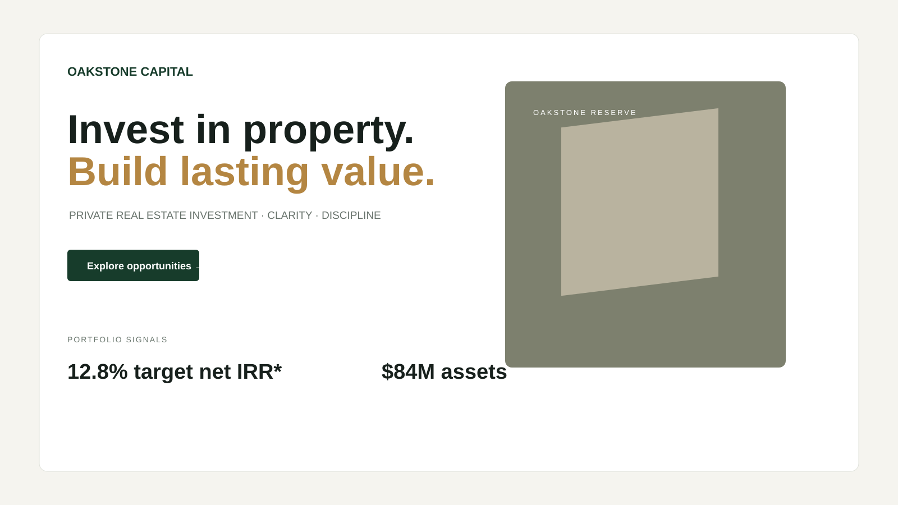

# Oakstone Capital — Real Estate Investment Landing Page

A premium real-estate investment landing page concept designed around trust, clarity, information hierarchy and investor lead generation.

## Portfolio objective
Demonstrate conversion-oriented financial UX, trust-building content structure, clear information hierarchy and restrained premium visual design.

## Design direction
- **Audience:** accredited/private investors and wealth-focused professionals
- **Primary conversion:** request investor access
- **Visual language:** warm editorial neutrals, deep green, muted gold, architectural imagery language
- **Typography:** Manrope + DM Sans

## Page architecture
1. Minimal navigation
2. Investment proposition hero
3. Trust and portfolio signals
4. Current opportunities
5. Investment rationale and metrics
6. Three-step investment approach
7. Investor-access CTA
8. Disclaimer-aware footer

## UX decisions
The hero establishes the investment proposition and proof points before asking for a lead. Opportunity cards provide scannable evidence, while the process section explains how risk is considered. Illustrative return figures are explicitly labeled so the design communicates credibility without presenting fictional performance as fact.

## Design feedback lens
Review for five-second clarity, trust signal placement, metric readability, CTA prominence, and whether the information hierarchy makes a complex investment proposition feel understandable.

## Tech
HTML5 · CSS3 · Google Fonts

> Portfolio concept — fictional company, properties and illustrative investment figures. Not investment advice.
